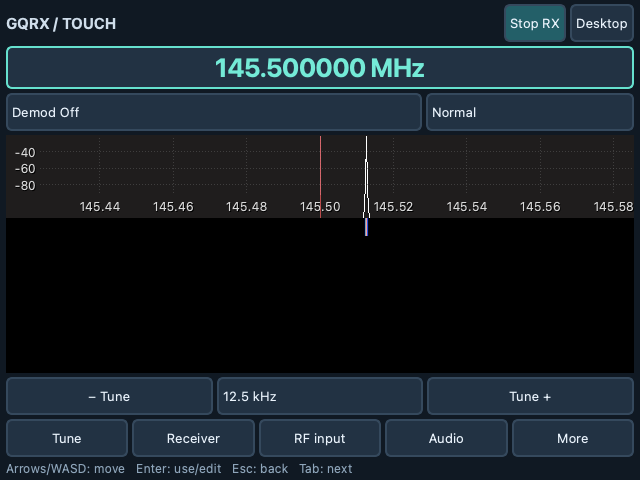
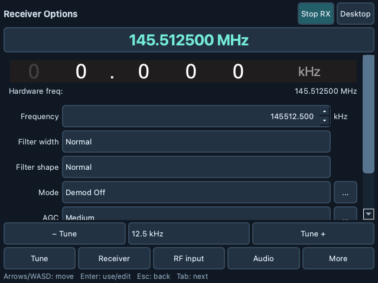

# Gqrx Touch

Gqrx Touch adds a switchable handheld interface for the Waveshare PocketTerm35's
640 × 480 display. It runs inside Gqrx and uses the same receiver, spectrum,
settings, device drivers, and signal connections as the desktop interface.



The screenshot shows the compiled application processing a synthetic I/Q file on
macOS at 640 × 480. It is not a photograph or an RF reception test on a Pi.

## Start and switch interfaces

```sh
gqrx --touch
gqrx --desktop
```

Choose **View → Touch interface** or press **Ctrl+Shift+T** to switch while Gqrx
is running. The **Desktop** button returns to the original interface. Switching
does not recreate the receiver or interrupt a recording. The UI choice and
frequency step are saved separately from the receiver configuration. Command-line
options override the saved startup choice; `--desktop` wins if both are supplied.

The installer also adds a **Gqrx Touch** application launcher. Use **More → Full
screen**, or F11, to use the whole display. On Plasma Mobile, keep display scaling
at 100% for the intended 640 × 480 layout. Fractional scaling and physical touch
calibration have not been tested on the PocketTerm.

Standard touch controls use a compact 38-pixel minimum height; frequency keypad
digits retain a 44-pixel minimum. Tight spacing leaves more room for the spectrum
and settings on the 640 × 480 display.

## Touch and keyboard controls

| Control | What it does |
| --- | --- |
| Frequency display | Opens a large numeric keypad; enter MHz, then Tune |
| − Tune / Tune + | Changes frequency by the selected step; hold to repeat |
| Mode / filter selectors | Controls the original demodulator and filter settings |
| Start RX / Stop RX | Starts or stops Gqrx's DSP |
| Tune | Spectrum and waterfall, with Gqrx's normal direct plot interaction |
| Receiver / RF input / Audio | Opens the original live controls in scrollable pages |
| More | FFT, bookmarks, RDS, meters/markers, device setup, recordings, decoders, configuration files, remote controls and help |
| Arrow keys or W/A/S/D | Moves focus toward another control |
| Enter | Activates a button or starts editing a selected field |
| Escape | Finishes editing; another Escape returns to Tune or closes a dialog |
| Tab / Shift+Tab | Moves between controls, including when editing |
| F | Opens the frequency keypad while navigating the main touch interface |
| Ctrl+Shift+T | Switches between touch and desktop |

While editing, arrows operate the field, slider, combo box, or list normally.
W/A/S/D become ordinary input, so names and filenames remain editable. A teal
outline identifies focus. Moving to an off-screen control scrolls it into view.
Touch scrolling uses Qt's touch gesture handling; scrollbars are also available.

Directional keys must arrive as keyboard arrow or WASD events. No raw gamepad/HID
reader or firmware remapping is included. The actual PocketTerm key events and
physical touchscreen behavior still need checking on the device.

The frequency keypad accepts up to six decimal places for Hz precision. Gqrx's
existing device and LNB limits still apply; the displayed frequency shows the
accepted value. Step sizes include 1 Hz through 1 MHz. The 8.333 kHz step is an
integer 8,333 Hz increment, not an aviation channel-number conversion.

## Full Gqrx controls



The add-on moves existing panel contents into scroll areas; it does not implement
a separate subset of the receiver. RF gain stages, AGC, squelch, filters, audio
recording/playback/UDP, FFT options, bookmarks and RDS keep their original widgets
and connections. More exposes upstream menu actions, including recent files.
Meters and marker controls are available under **More → Meters / markers**.

Qt dialogs are given scrollable contents and a Back / close button. The AFSK
window is adapted similarly. The original dialog's OK/Apply/Save buttons still
perform their normal jobs; Back / close cancels or closes the dialog. Native
platform file dialogs are disabled only while touch mode is active, allowing the
Qt file chooser to fit the small screen.

Advanced controls retain their desktop grouping, with larger targets and scrolling.
Some wide controls need horizontal scrolling, and the spectrum's fine markers and
filter handles retain upstream behavior. The desktop UI remains available for
precision mouse work. Feature access is preserved; exhaustive hardware testing of
every receiver feature has not been performed.

## Build on Raspberry Pi OS

These are source-build instructions for a Debian-based Raspberry Pi OS with Qt 5
and GNU Radio 3.10 packages. A native Qt 5 build has now passed on the Pi 4 deck;
see [deployment details](DEPLOYMENT-PI.md) for its installed paths and checks.
The existing Plasma Mobile session and OSK configuration need no changes.

In the local Gqrx Touch checkout:

```sh
sudo apt update
sudo apt install build-essential cmake pkg-config qtbase5-dev libqt5svg5-dev \
  qtwayland5 gnuradio-dev gr-osmosdr libpulse-dev

cmake -S . -B build/pi -DFORCE_QT5=ON -DENABLE_TOUCH_UI=ON \
  -DCMAKE_BUILD_TYPE=Release -DCMAKE_INSTALL_PREFIX="$HOME/.local"
cmake --build build/pi -j2
./build/pi/src/gqrx --touch
```

Use `-j2` initially to limit memory pressure. If configuration reports missing
hardware support, install the matching SDR driver packages for your receiver.
Debian's `gr-osmosdr` package includes the osmosdr development headers, and
`gnuradio-dev` pulls in the matching VOLK development package.

After checking the build, install under your account:

```sh
cmake --install build/pi
"$HOME/.local/bin/gqrx" --touch
```

Ensure `~/.local/bin` is on your session's PATH so the launcher resolves this build.
The distribution executable remains at `/usr/bin/gqrx` if installed separately.
Gqrx Touch normally shares Gqrx's receiver configuration. To try it with isolated
settings, run:

```sh
XDG_CONFIG_HOME="$HOME/.config/gqrx-touch-trial" ./build/pi/src/gqrx --touch
```

For Wayland, install the matching Qt Wayland plugin as above. If the plugin cannot
load in the existing session, test XWayland without changing the desktop session:

```sh
QT_QPA_PLATFORM=xcb ./build/pi/src/gqrx --touch
```

Qt 6 is also supported: install the corresponding Qt 6 development packages and
configure with `-DFORCE_QT6=ON` instead of `-DFORCE_QT5=ON` in a fresh build folder.
With CMake 4, older upstream CMake compatibility declarations may require
`-DCMAKE_POLICY_VERSION_MINIMUM=3.5`.

## Keeping up with upstream

The implementation is an optional, compiled presentation adapter in
`src/qtgui/touch/`. It is not a binary plugin that can attach to a stock installed
Gqrx executable. Disable it with `-DENABLE_TOUCH_UI=OFF` for a desktop-only build.

The integration points are the main-window setup/shutdown and desktop-layout
restore, two CLI options, CMake source registration, and the launcher. No receiver,
DSP, demodulator, driver, original `.ui` form or protocol source was changed.

The checkout has `origin` pointing at the `dylanmaniatakes/gqrx-touch` fork and
`upstream` pointing at `gqrx-sdr/gqrx`. After saving your local work, upstream
updates can be merged into your touch branch and rebuilt. Review changes to
`MainWindow`, dock ownership, menu actions and the named `modeSelector` /
`filterCombo` controls. Keeping the adapter separate reduces merge work but does
not make future upstream versions automatically compatible.

## Verification

See [VALIDATION.md](VALIDATION.md) for the tested environment and remaining device
checks. The Qt-only test suite does not require GNU Radio or an SDR:

```sh
cmake -S tests/touch -B build/touch-tests -DFORCE_QT5=ON
cmake --build build/touch-tests -j2
ctest --test-dir build/touch-tests --output-on-failure
```

The optional full integration test requires the normal Gqrx build dependencies,
Qt Test, and a working audio backend. It uses a temporary configuration and a
generated I/Q file, not a connected SDR:

```sh
cmake -S . -B build/integration -DFORCE_QT5=ON \
  -DENABLE_TOUCH_INTEGRATION_TESTS=ON
cmake --build build/integration -j2
ctest --test-dir build/integration --output-on-failure
```

Sources: [PocketTerm35 specifications](https://docs.waveshare.com/PocketTerm35),
[Gqrx upstream](https://github.com/gqrx-sdr/gqrx), and
[Debian gr-osmosdr packaging](https://packages.debian.org/stable/libdevel/gr-osmosdr).
